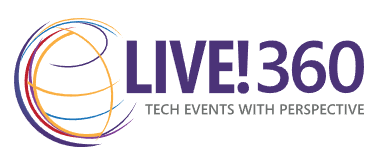

# VS Live 360 - Langchain Fundamentals
This is the repo for the November 19th 2024 session for VS Live 360 conference in Orlando, FL.

## Presenter: Lino Tadros

### [LinkedIn](https://www.linkedin.com/in/linotadros/)

## Session Description
At its core, LangChain is a framework built around LLMs. We can use it for chatbots, Generative Question-Answering (GQA), summarization, and much more. The core idea of the library is that we can “chain” together different components to create more advanced use cases around LLMs. Chains may consist of multiple components from several modules:

Prompt templates: Prompt templates are templates for different types of prompts. Like “chatbot” style templates, ELI5 question-answering, etc.
LLMs: Large language models like GPT-3, GPT-4, LLAMA, GEMINI, etc.
Agents: Agents use LLMs to decide what actions should be taken. Tools like web search or calculators can be used, and all are packaged into a logical loop of operations.
Memory: Short-term memory, long-term memory.

We will dive into each of these in much more detail in this session.

** While you are reading the description of the session above, Langchain source code changed 3 times :) 

## I hope you enjoy the session!
### Looking forward to seeing you in next year's VS Live 360 conference!
